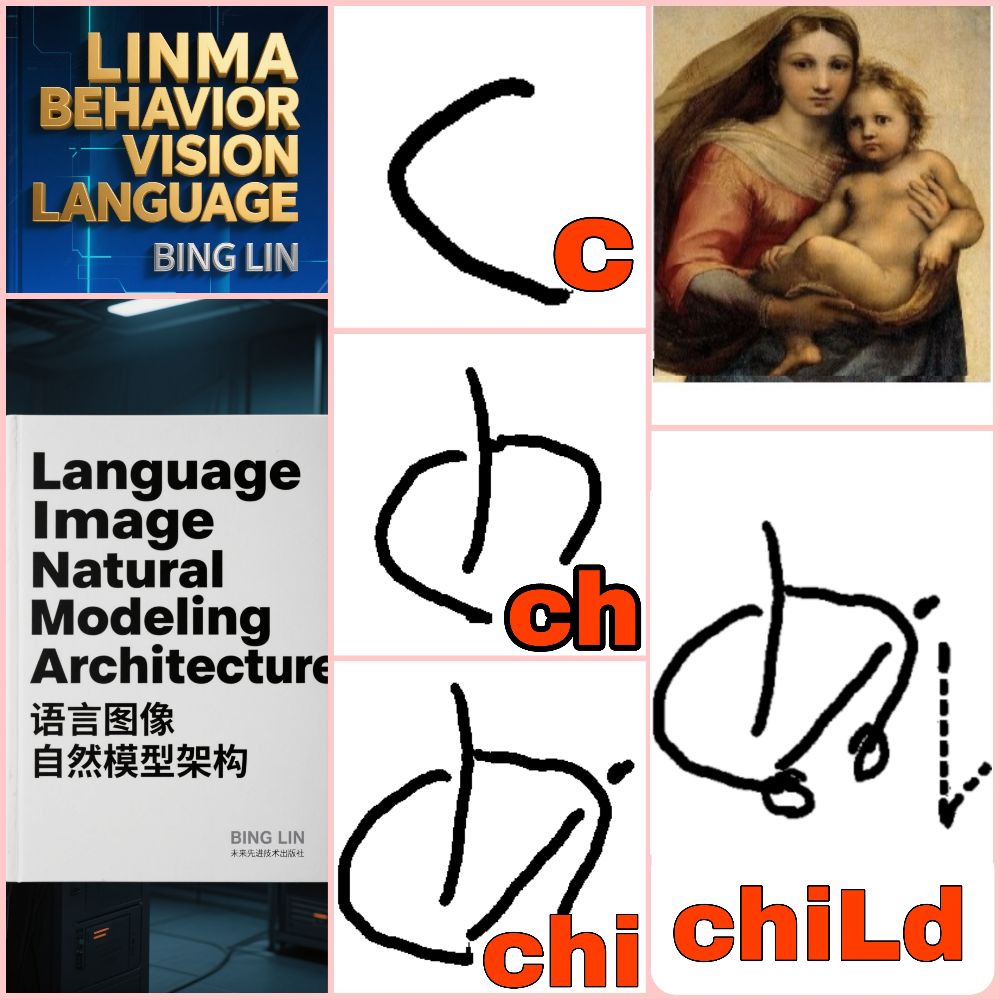

# LINMA

# (Language Image Natural Modeling Architecture)

###   [x:@linmaworld](https://x.com/linmaworld)

### [weibo:@linma](https://m.weibo.cn/u/7901318704)

### 
[github:linmaworld](https://github.com/linmaworld/LinmaNet)

| LINMA ABSTRACT |
|:---:|
|  | 

###  [LINMA PAPER vixra:2509.0024](https://vixra.org/abs/2509.0024) (  [PDF](https://vixra.org/pdf/2509.0024v1.pdf))

| LINMA STOne |
|:---:|
|  | 

| LINMA STOne Animation|
|:---:|

https://github.com/user-attachments/assets/ffab4c33-d38c-4789-afb1-8d74179e3317

| LINMA STICK |
|:---:|
|  | 

| LINMA chiLd |
|:---:|
|  | 

| LINMA Behavior Vision Language |
|:---:|
|  | 

LINMA STOne

https://github.com/user-attachments/assets/03e56bed-d168-4c8e-a3cd-8ee4c635a3a8

LINMA STICK

https://github.com/user-attachments/assets/1bf51706-a6ed-4461-aed5-6574fa02bf83

LINMA chiLd

https://github.com/user-attachments/assets/41b2c388-ab3f-49e4-8407-0538dcf38028

LINMA carry

https://github.com/user-attachments/assets/416363d7-bbe8-4f0a-bf6b-0ec6290397c6

LINMA crab

https://github.com/user-attachments/assets/f1ef6bf4-b26a-4ef3-971b-7c297b8243b8

| **LINMA's First Law (Law of Head)** |
|:---|
| S, is to depict Head. |

| LINMA's Second Law (Law of Limb Posture) |
|:---|
| T C h k n w u v g, etc., are to depict Limb Postures. |

| LINMA's Third Law (Law of Hand Shape) |
|:---|
| F m b p q d a i, etc., are to depict Hand Shapes. |

| LINMA's Forth Law (Law of Trajectory) |
|:---|
| L r o e, are to depict Motion Trajectories. |

