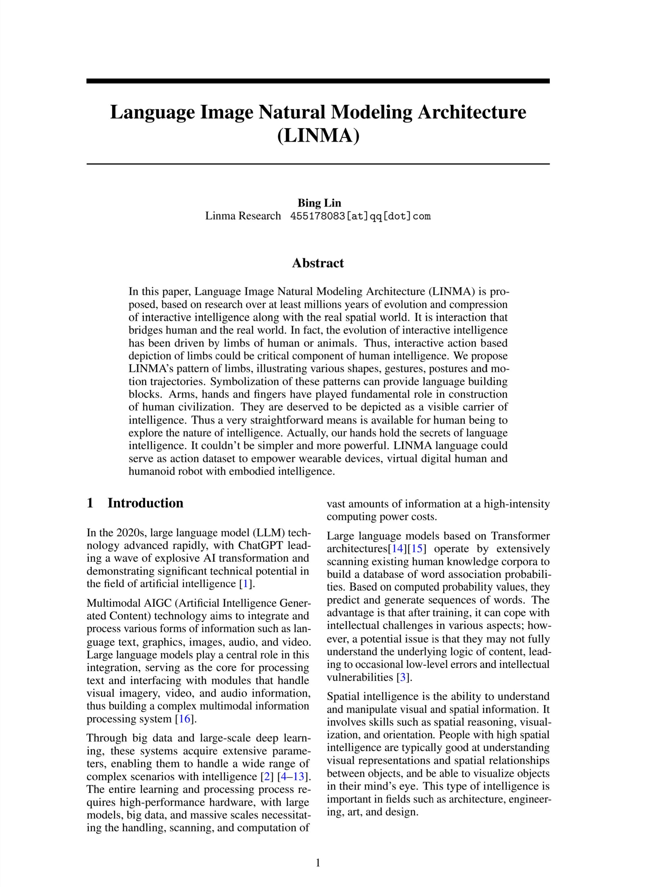
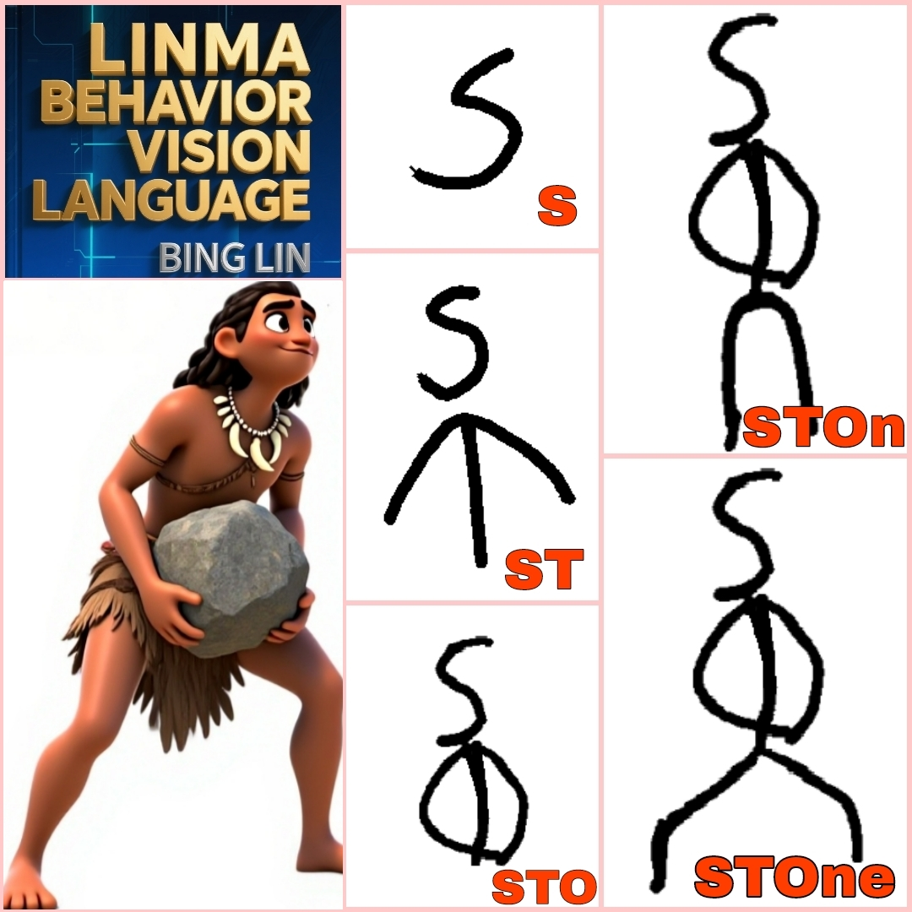
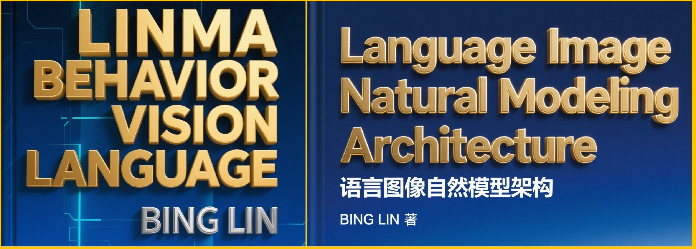

# LINMA

# (Language Image Natural Modeling Architecture)

###   [@linmaworld](https://x.com/linmaworld)

| LINMA ABSTRACT |
|:---:|
|  | 

###  [LINMA PAPER vixra:2509.0024](https://vixra.org/abs/2509.0024) (  [PDF](https://vixra.org/pdf/2509.0024v1.pdf))

| LINMA STOne |
|:---:|
|  | 

| LINMA STOne Animation|
|:---:|
|  | 

| LINMA STICK |
|:---:|
|  | 

| LINMA Behavior Vision Language |
|:---:|
|  | 

| LINMA's First Law (Law of Head) |
|:---|
| S, is to depict Head. |

| LINMA's Second Law (Law of Limb Posture) |
|:---|
| T C h k w u v g, etc., are to depict Limb Postures. |

| LINMA's Third Law (Law of Hand Shape) |
|:---|
| F m b p q d, etc., are to depict Hand Shapes. |

| LINMA's Forth Law (Law of Trajectory) |
|:---|
| L r o e, are to depict Motion Trajectories. |

` markdown
   
`

