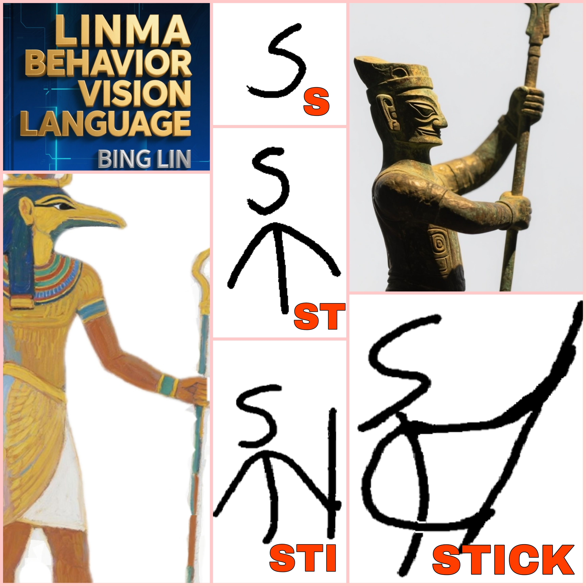

# LINMA

# (Language Image Natural Modeling Architecture)

###   [@linmaworld](https://x.com/linmaworld)£©

| LINMA ABSTRACT |
|:---:|
|  | 

###  [LINMA PAPER vixra:2509.0024](https://vixra.org/abs/2509.0024) (  [PDF](https://vixra.org/pdf/2509.0024v1.pdf))

| LINMA STOne |
|:---:|
|  | 

| LINMA STOne Animation|
|:---:|
|  | 

| LINMA STICK |
|:---:|
|  | 

| LINMA |
|:---:|
|  | 

